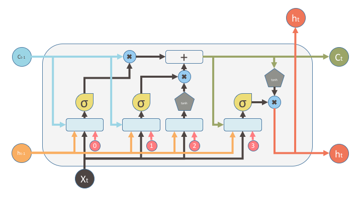

<h1>LSTM Text Generator</h1>

<h2>About this notebook</h2>

I wrote this network following some tutorials to put in practice the theory behind the RNNs and LSTMs in particular.

I trained the network using <b>Google Colab</b> (info ) for 40 epochs, so not too much, indeed the results are not the best, but at least the chars are combined in the right way

<h2>Recurrent Neural Network</h2>

</img>

A recurrent neural network (RNN) is a class of artificial neural network where connections between units form a directed graph along a sequence. This allows it to exhibit dynamic temporal behavior for a time sequence.

<h2>When you should use a RNN</h2>
<ul>
    <li>NLP, like translation, sentiment analysis, summarization and more</li>
    <li>Sequential data, like stock prices, time series, music ecc.</li>
    <li>Get a caption of an image giving an image as input, and viceversa</li>
</ul>

<h2>The problem of RNNs</h2>

Well, RNNs are one of the most powerful model out there, but of course, it has some limits. The biggest problem is the <b><i>vanishing/exploding gradient</i></b>. In fact, if you want to run a RNN on long sequences, you have to run it over many time steps and this means a very deep network.

So the training time could be very very looong. But there's another problem: when the data goes through the network, they are transformated more and more, and as you can image, after a while there will be no trace of the first input.

<h2>The solution: LSTM</h2>

Fortunately, in 1997, Sepp Hochreiter and Jurgen Schmidhuber proposed the <i>Long Short-Term Memory</i>.

</img>

I won't go into details (for now), but in short "an LSTM can learn to recognize an important input (that's the role of the input gate), store it in the long-term state, learn to preserve it for as long as it is needed (that's the role of the forget state), and learn to extract it when it is needed." <i>(from Hands-On Machine Learning with Scikit-Learn and TensorFlow, by Aurélien Géron)</i>
 

<h2>References</h2>
<ul>
    <li><a href="https://en.wikipedia.org/wiki/Recurrent_neural_network">Wikipedia</a></li>
    <li><a href="http://shop.oreilly.com/product/0636920052289.do">Hands-On Machine Learning with Scikit-Learn and TensorFlow</a></li>
    <li><a href="http://colah.github.io/posts/2015-08-Understanding-LSTMs/">Understanding LSTMs</a></li>
</ul>

