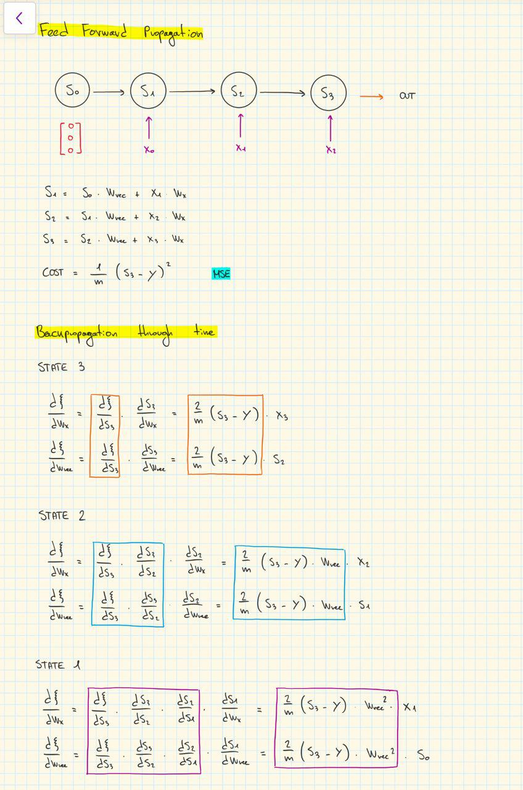

<h1>Vanilla Recurrent Neural Network</h1>

Very simple RNN written to understand the theory and the math behind such a neural network.

</img>

<h2>Reference: </h2>
<ul>
    <li><a href="https://medium.com/@SeoJaeDuk/only-numpy-vanilla-recurrent-neural-network-back-propagation-practice-math-956fbea32704">Jae Duk Seo's post on Medium</a></li>
    <li><a href="http://peterroelants.github.io/posts/rnn_implementation_part01/#Updating-the-parameters">More details</a></li>
</ul>